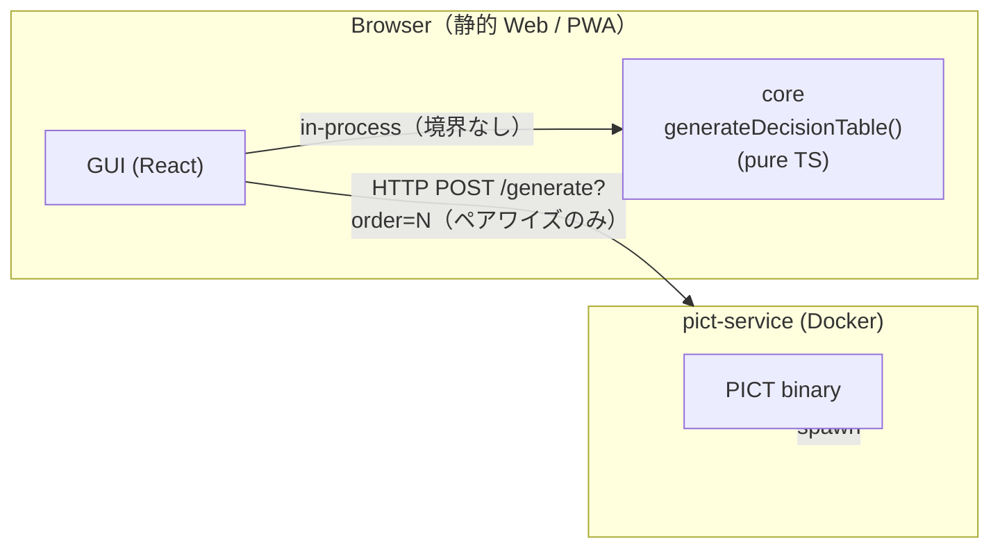
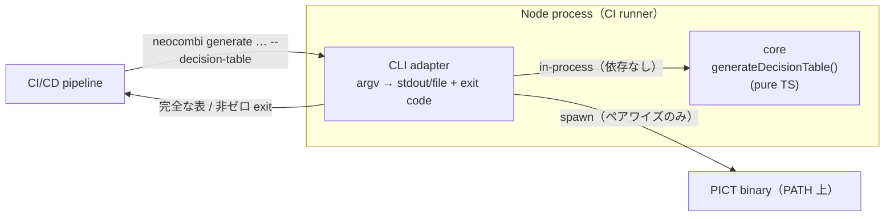
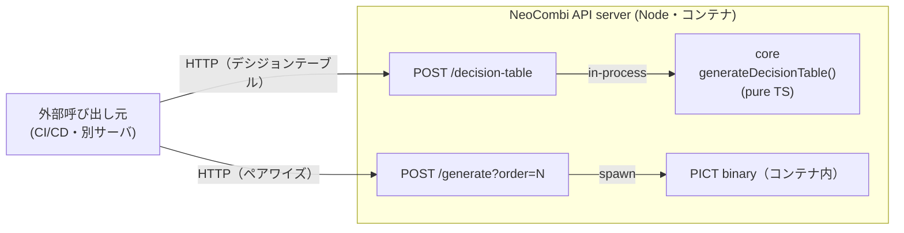

# NeoCombi Requirements Specification

> User Requirements (UR) と System Requirements (SR) の Markdown ビュー（人間向けの読みやすい view）。
> **一次資料は YAML**（`Doc/requirements/user_requirements.yaml`、`Doc/requirements/system_requirements.yaml`）。本ファイルはそれを元に手で書き起こしている。整合性が崩れた場合は YAML が正であり、本ファイルを更新する。
>
> Status: draft (2026-06-21, v0.2-draft). MVP planning + v0.2 候補（UR-008）+ PICT-PAPP 継承の全組み合わせ生成（UR-009、実装済み）+ 合否カウントフラグ／安定 ID／外部書き戻し（UR-010）＋テストセット永続化・無再生成（UR-011）（仕様合意済み・実装前）。**本ファイルは仕様レビュー＆合意のための view であり、コーディング着手の前提**（`CLAUDE.md` 「ドキュメント・ファースト」方針）。

## 1. 概要 — Overview

**NeoCombi** は、ペアワイズ組み合わせテストと因子・水準・制約の管理を統合した総合組み合わせテスト設計ツール。Microsoft **PICT**（Pairwise Independent Combinatorial Testing）を内部エンジンとして外部 CLI で呼び出し、その制約言語（[PICT BNF サブセット](../DSL_Grammar_Specification.md)）を一級構文として扱う。

著者の旧 Excel VBA ツール **PICT-PAPP** を React + TypeScript で再構築した機能的後継であり、HAYST 法 100〜300 因子規模の実務に耐えることを目標とする。

NeoCombi は **3 兄弟** の一員：

- **[NeoCEG](https://github.com/sho1884/NeoCEG)** — 原因結果グラフ（CEG）ツール
- **NeoCombi** — 本プロジェクト（ペアワイズ + 因子水準）
- **[ModelLogue](https://github.com/sho1884/ModelLogue)** — AI レビュープラットフォーム

NeoCEG / NeoCombi は決定論変換器（AI 不内蔵）。AI 連携は n8n 経由のパススルーに限定（[ADR-003](../adr/ADR-003-no-embedded-ai-n8n-passthrough.yaml)）。アーキテクチャ判断は [`PROJECT_KICKOFF.md`](../PROJECT_KICKOFF.md)、技術判断は [`adr/`](../adr/) を参照。

## 2. MVP スコープ — MVP Scope

### 2.1 含める

- DSL（PICT BNF 最小サブセット）の編集・検証・エラー表示
- 因子・水準表の編集（DSL と双方向同期）
- 上ペーンの総当たり表（チェックボックスで因子表示制御、出現回数オーバーレイ）
- 内製 DSL 評価器による多項間禁則表（参照ビュー、N 切替）
- PICT 外部 CLI 呼び出しによるテストケース生成（ペアワイズ / N-wise）
- 全組み合わせ（デシジョンテーブル）生成（UR-009）── 内製評価器で全因子直積を全行出力、禁則行は除外せず印を付ける。テストケース表の生成モードとして同居。上限超過は拒否
- テストケース表 + メモ・備考カラム（旧「期待値」、UR-005）。各ケースに安定 ID とカバレッジ「カウント対象」フラグ（UR-010）。網羅集計は対象行のみ
- 生成済みテストセットの永続化（行・ID・フラグ・メモ）と無再生成での再開、破壊的操作ガード（UR-011）
- `.tmodel` プロジェクトファイル形式（[ADR-009](../adr/ADR-009-tmodel-file-extension.yaml)）
- CLI モード（CI/CD 向け headless 実行）

### 2.2 含めない（v2 以降）

- AI 連携（n8n 経由の自然言語 → DSL 生成。最終ビジョンとしてレイアウトだけ準備）
- DSL の `LIKE` 演算子、サブモデル、weight、negative value
- PICT-PAPP の Step5（Alloy 検証）、Step6/7（水準値展開）、Step1'（多項間禁則表からの DSL 自動生成）
- CIT-BACH 等、PICT 以外の生成エンジン対応

## 3. User Requirements

優先度は high / medium / future の 3 段階。high と medium が MVP 対象、future は最終ビジョンとして記録のみで AC は v2 で書く。

### UR-001 — Generate pairwise test cases

- **Priority:** high
- **Background:** Pairwise（または N-wise）テストケース生成は、前身ツール PICT-PAPP から継承する核機能。NeoCombi は生成アルゴリズムを Microsoft PICT に委譲（外部 CLI として呼び出し、[ADR-002](../adr/ADR-002-invoke-pict-as-external-cli.yaml)）し、本体は前後処理（DSL オーサリング、可視化、出力整形）に専念する。

### UR-002 — Author factors, levels, and constraints

- **Priority:** high
- **Background:** テスト設計者は問題空間を因子と水準で表現し、実行不能な組合せを制約で除外する。制約は PICT DSL（[サブセット仕様](../DSL_Grammar_Specification.md)）で直接記述する。因子・水準表と DSL エディタは下ペーンを共有し、タブで切り替える（[ADR-006](../adr/ADR-006-split-pane-with-tabbed-bottom.yaml)）。

### UR-003 — Verify forbidden combinations derived from constraints

- **Priority:** high
- **Background:** 制約式（intensional 表現）は禁則 N 因子組合せ（extensional 表現）を含意する。設計者は導出された禁則集合が意図と一致するかを視覚的に確認したい。本ビューは内製 DSL 評価器が DSL から計算する read-only ビューで（[ADR-005](../adr/ADR-005-builtin-dsl-evaluator.yaml), [ADR-007](../adr/ADR-007-forbidden-matrix-as-reference-view.yaml)）、ユーザはセルを直接編集できない。N をスライダで選択でき、マトリクスは「条件因子 × 被制約因子」のスライスを 1 枚ずつ表示する。

### UR-004 — Verify pair coverage of generated test cases

- **Priority:** medium
- **Background:** PICT 生成後、各因子ペアがカバーされたか（あるいは禁則 vs 漏れか）を確認したい。上ペーンの総当たり表に出現回数をオーバーレイ表示する。各因子の行にチェックボックスを置き、表示対象因子を絞れる。

### UR-005 — Record a free-form note per test case

- **Priority:** high
- **Background:** 各テストケース行に自由記入のテキスト列を持つ（PICT-PAPP には無い新機能、[ADR-008](../adr/ADR-008-expected-value-column-in-test-cases.yaml)）。当初は「期待値」として設計したが、実体は設計時メモで、期待結果はその一用途にすぎない（備考・参照・根拠なども等しく有効）。よって列名は **「メモ・備考 / Notes」**（アノテーションキー `@neocombi:note`）。メモは永続化テストセット（UR-011）と共に保持され、CSV/JSON エクスポートと書き戻し CSV（UR-010）にも載る。

### UR-006 — Invoke from CI/CD pipeline deterministically

- **Priority:** medium
- **Background:** テスト設計はバージョン管理された入力から再現可能であるべき。NeoCombi は CLI モードを提供し、`.tmodel` ファイルを入力として CSV/JSON を出力する（GUI 非依存、headless 動作）。同じ入力からは常に同じ出力（AI 不内蔵、非決定性なし）。

### UR-007 — Draft DSL from natural-language requirements via AI

- **Priority:** future（MVP 範囲外）
- **Background:** 最終ビジョン：設計者が下ペーンの専用タブにテスト対象の振る舞いを自然言語で書き、AI（n8n 連携経由）が PICT DSL を起草、人間がレビュー＆修正して完成させる。NeoCombi 本体は決定論変換器のままで、AI は外部パススルー、内蔵しない（[ADR-003](../adr/ADR-003-no-embedded-ai-n8n-passthrough.yaml)）。MVP では下ペーンのレイアウトとデータモデルだけを将来拡張可能な形で固める。ModelLogue の n8n 連携実装が成熟したら同パターンに追従。

### UR-008 — Make mask levels easy to author and hard to forget

- **Priority:** medium（v0.2 候補）
- **Background:** 「mask 水準」とは、ある因子が他因子の値で実質的に到達不能になる状態（例：支払方法=現金 のときカード番号は実質存在しない）。前身 PICT-PAPP の運用慣習を継承し、影響を受ける因子に専用水準を 1 つ加え、トリガ条件の IF-THEN でその水準に固定する ── **既存の PICT DSL でそのまま表現でき、拡張も新オペレータも新データモデルも不要**。NeoCombi は変更しない DSL の上に UI 補助 2 点（特別記号での入力・表示／不備警告 lint）を追加し、「mask 水準を立てるのを忘れて生成テストケースから masked 状況が静かに脱落する」リスクを減らす。

### UR-009 — Design test cases with a decision table (all-combination generation)

- **Priority:** high
- **Background:** 因子が少ない時に、**全因子水準の全組み合わせを並べ、あり得ない（禁則）組み合わせに印を付け、各組み合わせに期待結果を書いて 1 組み合わせ＝1 テストケースとして設計する** ── 普通のデシジョンテーブルによるテスト設計。前身 PICT-PAPP の機能で、NeoCombi には欠落している。ペアワイズ（UR-001）の補完関係：因子が多く全直積が爆発する時はペアワイズ（PICT）、因子が少なく網羅したい時はデシジョンテーブル。設計者は生成モードとして使い分ける。
- **著者確認済みの挙動：** 表は**全直積を全行残し、禁則行は除外せず印**を付ける。禁則判定は内製 DSL 評価器（forbidden view と同じ、UR-003）を再利用し、PICT は使わない（PICT は「印付きの全直積」を出せない）。期待値列（UR-005）と CSV/JSON エクスポートが乗る。
- **スケールのガードレール：** 禁則を残すので直積は減らない。**組み合わせ数が 4096 を超えたら生成を断る**（デシジョンテーブルは本来少因子向けだが、ユーザが過大なモデルを作る可能性への歯止め）。件数と上限を示し、部分的な表は一切出さない。
- **3 つのデプロイ（いずれも同格・1 つの共有純粋コアの異なる構成）：** GUI（ブラウザ内でコア実行・テストケース表の生成モード）／ CLI（CI/CD・1 プロセス内でコア実行、PICT もネットワークも不要）／ HTTP API（サーバ内でコア実行、pict-service に `/decision-table` を追加、外部から呼ぶ）。**CI/CD パイプラインに CLI でも API でも組み込めること**が要点。どのデプロイでも出力は原子的（完全な表か、きれいなエラーか。部分表は出さない）。詳細なインタフェースと 3 構成図は §4.11 を参照。

### UR-010 — Gate coverage by a per-case count flag, with stable IDs for external round-trip

- **Priority:** high
- **Background:** 今の網羅率は「予定網羅」── 生成した全ケースが**合格する前提**の上限値。実際の達成網羅は、ケースを実行して受理されて初めて成立する。ケースは不合格（バグ）／実行不能（制約見落とし）／未実施のいずれにもなり得るが、網羅にとっては全部同じ＝**カウントしない**。
- **カウント対象フラグ：** 各生成ケースに2値の「カウント対象」フラグ（既定＝対象）を持たせる。網羅マトリクスと網羅率（UR-004）は**対象行のみ**で集計し、対象外行だけが覆うペアは「未達」と表示する ── どの組み合わせが実カバレッジを失ったか（再テスト／追加ケースが要るか）が見える。フラグは「合否」ではなく中立な**「カウントする／しない」**とし、チームが運用で意味づけできるようにする。
- **テスト実行管理はしない：** 実行・結果管理は別システムの責務。書き戻しのため、各ケースは安定・永続・人間可読の **ID** を持つ：ペアワイズは `P`＋連番、デシジョンテーブルは `D`＋連番、ゼロ詰めはその表の件数の桁数に合わせる（例 `P01..P11`、`D0001..D1944`）。ID は GUI にも表示。フラグ（とメモ、UR-005）は GUI 手動、または外部システムからの **3列固定 CSV（ID・カウントフラグ・メモ）を ID 一致で書き戻し**て設定できる。NeoCombi は決定論的な前後処理ツールのまま、きれいな統合接合点だけを持つ。

### UR-011 — Persist the generated test set and resume work without regenerating

- **Priority:** high
- **Background:** カウントフラグ（UR-010）とメモ（UR-005）をセッション跨ぎ・外部システム連携で使うには、生成済みテストセット自体（行・ID・フラグ・メモ）を保存し**そのまま復元**、読込時に**再生成しない**必要がある。理由は2つ：ペアワイズ出力は PICT 実行ごとに同一とは限らず、再生成すると記録が実際にテストした行から外れる／設計者はテスト後にプロジェクトを開いて記録状態から続けたい。再生成は自動ではなく**明示操作**に格下げ。
- **破壊的操作ガード：** フラグやメモは失うと復元が高くつくので、それらを捨てる操作（再生成、保存セットを無効化する DSL 編集、上書きを伴う書き戻しインポート）は、**フラグ／メモが1件でもあれば**「すべて失ってよいか」を必ず確認し、続行 or 留まるを選ばせる。記録は黙って捨てない。

## 4. System Requirements

カテゴリ別に整理（10 番台で連番）。各 SR の `function`（Verb + Object）と主要 outcome を要約。詳細シナリオは [`system_requirements.yaml`](system_requirements.yaml) 参照。

### 4.1 dsl_authoring（SR-001..003） — Parent: UR-002

DSL エディタは下ペーンの 1 タブとして提供。PICT BNF サブセットを直接書く（[ADR-001](../adr/ADR-001-mirror-pict-bnf-subset.yaml)）。

| ID | Function | 概要 |
|---|---|---|
| SR-001 | Edit DSL text in editor | DSL タブで自由テキスト編集。空状態では grammar spec へのプレースホルダリンク表示 |
| SR-002 | Validate DSL syntax in real time | 編集ごとに incremental parse。LIKE / submodel / weight / negative value は `unsupported in MVP` 診断 |
| SR-003 | Display syntax errors with location | エラー位置にアンダーライン、ホバーでメッセージ。複数エラーはサイドパネルでリスト表示 |

### 4.2 factor_level_table（SR-010..012） — Parent: UR-002

因子・水準表は DSL のパラメータセクションを構造化したビュー。両者は双方向に同期する。

| ID | Function | 概要 |
|---|---|---|
| SR-010 | Manage factors | 因子の追加・改名・削除。DSL 宣言と他参照（制約・テストケース・マトリクス）が連動更新 |
| SR-011 | Manage levels per factor | 水準の追加・改名・削除。改名時は内部 ID で参照を維持 |
| SR-012 | Synchronize factor-level table with DSL | DSL → 表（parse 成功時に再描画）／表 → DSL（コミット時にパラメータセクション再生成、制約・コメントは保持） |

### 4.3 bottom_pane（SR-020） — Parent: UR-002

下ペーンのタブ切替コンテナ。MVP では 3 タブ、将来 4 タブに拡張する設計（[ADR-006](../adr/ADR-006-split-pane-with-tabbed-bottom.yaml)）。

| ID | Function | 概要 |
|---|---|---|
| SR-020 | Switch bottom-pane tab | タブヘッダクリックで切替。タブ間で編集状態は保持。AI 連携 ON 時は「自然言語要求仕様」タブを追加（v2） |

### 4.4 forbidden_view（SR-030..033） — Parent: UR-003

多項間禁則表のビュー。**PICT 非依存** — 内製 DSL 評価器が計算する（[ADR-005](../adr/ADR-005-builtin-dsl-evaluator.yaml)）。

| ID | Function | 概要 |
|---|---|---|
| SR-030 | Compute N-factor forbidden combinations from DSL | 内製評価器がスライス内の全水準組合せを列挙し DSL を評価 |
| SR-031 | Render multi-factor forbidden-combination matrix slice | 2D マトリクス。行 = 条件因子の水準組合せ（ネスト）、列 = 被制約因子の水準 |
| SR-032 | Configure matrix slice | N（≥2）と「条件因子 N-1 個 + 被制約因子 1 個」の選択 |
| SR-033 | Manage multiple matrix slices as switchable views | 複数スライスをタブ的に切替（並列表示はしない） |

### 4.5 coverage_view（SR-040..043） — Parent: UR-004

上ペーンの総当たり表。PICT 生成結果からの出現回数をオーバーレイ。

| ID | Function | 概要 |
|---|---|---|
| SR-040 | Render exhaustive cross-tabulation matrix in top pane | 全因子ペアの水準交叉表 |
| SR-041 | Toggle factor visibility via per-row checkbox | 因子行のチェックボックスで表示対象を絞る |
| SR-042 | Overlay occurrence count from generated test cases | 各セルにテストケース出現回数。禁則セル / 漏れセルを視覚的に区別 |
| SR-043 | Highlight uncovered non-forbidden combinations | 「禁則ではないのに未出現」のセルを警告色（黄色）で強調 |
| SR-044 | Count only flagged-in cases toward coverage | カウント対象フラグ（SR-055）が全網羅計算をゲート。対象外行は寄与せず、それだけが覆うペアは未達表示。＝達成網羅（既定は全対象なので初期は予定網羅と一致） |

### 4.6 test_case_table（SR-050..056） — Parent: UR-001, UR-005, UR-009, UR-010

テストケース表（GUI）。**生成モード**を持ち、ペアワイズ/N-wise（PICT、削減済み集合）とデシジョンテーブル（内製コア、全行＋禁則列）を同一表で切替える。各ケースに ID・カウント対象フラグ・メモ列を持つ（[ADR-008](../adr/ADR-008-expected-value-column-in-test-cases.yaml)）。禁則行はテストケースではないので ID・フラグなし。CLI/API は同じデシジョンテーブル結果を各形式で出す（SR-104/105）。

| ID | Function | 概要 |
|---|---|---|
| SR-050 | Display generated test cases | 1 行 = 1 ケース。列＝ID＋カウントフラグ＋因子＋メモ。デシジョンテーブルは禁則行も含め全行＋禁則マーカー列（禁則行は ID・フラグなし） |
| SR-051 | Provide a free-form notes column | 「メモ・備考 / Notes」（`@neocombi:note`）。自由テキスト。旧「期待値」 |
| SR-052 | Keep notes and flags attached to their test cases | 永続セット（SR-072）でケース ID にメモ・フラグを束縛。読込で無再生成復元。明示再生成のみが破棄（SR-073 ガード越し） |
| SR-053 | Export test cases as CSV / JSON | エクスポート列＝ID＋カウントフラグ＋因子＋メモ。デシジョンテーブルのときは禁則マーカーも含める |
| SR-054 | Assign a stable ID to each test case | ペアワイズ `P`＋連番／デシジョンテーブル `D`＋連番。件数の桁数にゼロ詰め。生成時付与・永続・GUI 表示・明示再生成のみ振り直し。禁則行は ID なし |
| SR-055 | Provide a per-case 'count toward coverage' flag | 2値・既定=対象。中立な「カウントする/しない」。網羅計算（SR-044）をゲート。禁則行はフラグなし |
| SR-056 | Write back results from a three-column CSV matched by ID | 因子列 CSV とは別経路。`id,count,note`（ヘッダ付き、flag は true/false）を ID 一致で書き戻し。未一致行は飛ばして報告。上書き時は SR-073 ガード |

### 4.7 pict_invocation（SR-060..063） — Parent: UR-001

PICT は外部 CLI として呼ぶ（バンドルしない、[ADR-002](../adr/ADR-002-invoke-pict-as-external-cli.yaml)）。

| ID | Function | 概要 |
|---|---|---|
| SR-060 | Invoke PICT external CLI with DSL-derived input file | 子プロセス spawn、stdout 取得、エラーハンドリング |
| SR-061 | Configure PICT executable path | ユーザ設定で path 指定、永続化 |
| SR-062 | Configure generation order N | N=2 が既定（pairwise）。`/o:N` で渡す |
| SR-063 | Parse PICT output into test case data | TSV → テストケースレコード |

### 4.8 persistence（SR-070..073） — Parent: UR-001, UR-002, UR-005, UR-006, UR-011

`.tmodel` 単一ファイルでプロジェクト保存（[ADR-009](../adr/ADR-009-tmodel-file-extension.yaml)）。DSL に加えて**生成済みテストセット（行・ID・フラグ・メモ）**を保存し、読込は無再生成で復元する。

| ID | Function | 概要 |
|---|---|---|
| SR-070 | Save project as .tmodel file | DSL + 永続テストセット（各ケースの ID・カウントフラグ・メモ・水準値、stable id 付き）+ ビュー状態 + 生成設定（モード + N） |
| SR-071 | Load project from .tmodel file | テストセット（行・ID・フラグ・メモ）含め復元、**再生成しない**。forward migration、DSL parse 失敗時は editor で開いて修正可能 |
| SR-072 | Treat the persisted test set as authoritative; do not auto-regenerate | 保存行が正。読込・プロジェクト open で自動再生成しない（ペアワイズは PICT 再実行で同一保証なし／記録を実行行に束ねるため）。再生成は明示操作のみ |
| SR-073 | Guard destructive actions when flags or notes exist | フラグ／メモを捨てる操作（再生成・無効化 DSL 編集・上書きインポート SR-056）は、1件でも記録があれば「すべて失ってよいか」を確認し続行/留まるを選ばせる。無ければ無確認で続行 |

### 4.9 cli_mode（SR-080..082） — Parent: UR-006, UR-009

CI/CD 向け headless 実行。GUI と engine 層を共有（[ADR-004](../adr/ADR-004-cli-and-gui-dual-modes.yaml)）。

| ID | Function | 概要 |
|---|---|---|
| SR-080 | Run NeoCombi as CLI consuming .tmodel input | `neocombi generate <input.tmodel>` でテストケースを stdout / file に出力。`--decision-table` でデシジョンテーブル生成（詳細・終了コードは SR-104） |
| SR-081 | Exit with deterministic exit codes | 0=success, 1=parse, 2=PICT failure, 3=I/O input, 4=I/O output（+ SR-104 が **5=too-large** を追加） |
| SR-082 | Run headless without GUI dependencies | display server なしで動作。GUI bundle 未インストールでも CLI 単独動作。**両モードに適用** ── ペアワイズは外部 PICT CLI を GUI/CLI 双方から spawn して headless がタダで揃うが、デシジョンテーブルは内製の純粋コアを**共有エンジン層に置き headless 呼び出し可能**にし、GUI（SR-100）/ CLI（SR-104）/ HTTP API（SR-105）の 3 つが同一コアを叩く。CLI と API は UR-009 の同格要件 |

### 4.10 mask_level（SR-090..092） — Parent: UR-008

mask 水準の authoring 補助。DSL は変更せず、固定トークン `_MASK_` を「mask 水準」として識別する規約と、その水準が結合制約を持たない場合の警告を加える。

| ID | Function | 概要 |
|---|---|---|
| SR-090 | Recognize a level as the mask level via the fixed sentinel value `_MASK_` | 全因子共通の固定文字列 `_MASK_`（case-sensitive、前後アンダースコア込み）を mask 水準として識別。PICT-PAPP の `MASK` 命名継承＋姉妹ツール NeoCEG の MASK 制約との概念リンクを明示。アンダースコアで囲んで「framework-magic name」感を出すと同時に、PICT 識別子規則と完全互換（DSL ソースを直接 PICT へ渡せる、ADR-001 の subset 原則を満たす）。Factor 表で rename 不可（削除＋再追加のみ）、因子あたり最大 1 個 |
| SR-091 | Display mask levels distinctly across level-displaying views | 因子・水準表 / 禁則マトリクス（列ヘッダ）/ coverage マトリクス（行・列ヘッダ）/ テストケース表 の **4 面** で統一的に muted-italic 表示（色 + 字体の 2 チャネル）。値文字列はそのまま `_MASK_`（コピペ・CSV エクスポートで literal 維持）。**DSL エディタは対象外** — 素 textarea ゆえスタイル付与に syntax-highlight エディタ移行が必要で UR-008 のスコープを超える |
| SR-092 | Warn when a mask level has no triggering constraint | `_MASK_` 水準には「いつ `_MASK_` になるか」と「それ以外の場合は `_MASK_` であってはならない」を両方指定する制約式が必要。これが無いと PICT は `_MASK_` を普通の水準として他因子の任意の値とペア被覆し、本来 mask にならないはずの場面で mask 状態のテストケースが生成される。モデル不備として **warning**（severity = warning、PICT 実行はブロックしない）。現在のチェックは「`_MASK_` への束縛が一切無い」場合のみ検知（reverse direction 専用チェックは未実装）。クリックで Factor 行へジャンプ |

### 4.11 all_combinations（SR-100..105） — Parent: UR-009

デシジョンテーブルによるテスト設計（全組み合わせ生成）。**PICT 非依存** — 全行＋禁則印は PICT では出せず、禁則ビューと同じ内製評価器（[ADR-005](../adr/ADR-005-builtin-dsl-evaluator.yaml)）の直積列挙で生成。GUI・CLI・HTTP API の 3 デプロイが、1 つの純粋コアを各々の構成で共有する。

| ID | Function | 概要 |
|---|---|---|
| SR-100 | Select generation mode (pairwise/N-wise vs decision-table) | GUI の生成コントロールで 2 モード選択。pairwise/N-wise は PICT（`/o:N`）、デシジョンテーブルは内製コア（PICT path 不要）。選択はプロジェクトに永続化（SR-070） |
| SR-101 | Generate the decision table via the built-in core (shared contract) | `generateDecisionTable(model)` ── **純粋・同期・IO 非依存**のエンジン層関数。GUI/CLI/API が共有する唯一の契約。全因子の全水準割当を**全行**列挙（禁則も残す）、各行を禁則判定。**完全な表 / too-large / invalid-model の 3 値**のみ返し、**部分表は返さない** |
| SR-102 | Mark forbidden rows in the decision table | 各行を禁則ビューと同じ評価器で判定し、禁則フラグを付与（GUI ではマーカー列＋行スタイル）。除外せず残す。フラグはデータモデルに乗り、エクスポート・API 応答にも含まれる |
| SR-103 | Refuse decision-table generation above 4096 combinations | 列挙前に直積（各因子水準数の積）を計算。**4096 超なら too-large を返し列挙しない**（部分出力なし）。禁則ビューの上限とは**独立した固定値 4096** |
| SR-104 | Expose the decision table via the CLI | 1 Node プロセスでコアを in-process 実行。`neocombi generate <m.tmodel> --decision-table [--format csv\|json] [--output f]`。出力は原子的。終了コード：0 成功／1 invalid-model／3 入力不可／4 出力失敗／**5 too-large**（2=PICT 失敗はこのモードでは不使用） |
| SR-105 | Expose the decision table via the HTTP API | pict-service に `/decision-table` を追加（`/generate` と並置）。`POST /decision-table`（body=DSL）→ **200** 完全な表／**400** invalid-model／**413** too-large。応答は原子的。サーバは `/generate` 用に PICT、`/decision-table` 用に純粋コアの両方を持つ |

#### 共有コアの契約（唯一の真実）

CLI の終了コードも HTTP のステータスも、この戻り値 3 値の写像にすぎない：

```ts
// engine 層・pure・同期・IO/DOM/HTTP 非依存・決定論
function generateDecisionTable(model: Model): DecisionTableResult

type DecisionTableResult =
  | { ok: true;  columns: string[]; rows: { values: string[]; forbidden: boolean }[] }
  | { ok: false; reason: 'too-large';     count: number; limit: 4096 }
  | { ok: false; reason: 'invalid-model'; diagnostics: Diagnostic[] }
```

| コア結果 | CLI 終了コード | HTTP ステータス |
|---|---|---|
| `ok` | 0（完全な表を出力） | 200（表 JSON） |
| `too-large` | 5（件数・上限を stderr） | 413（`{reason,count,limit:4096}`） |
| `invalid-model` | 1（診断を stderr） | 400（`{reason,diagnostics}`） |
| 入力ファイル不可（CLI のみ） | 3 | — |
| 出力書き込み失敗（CLI のみ） | 4 | — |

#### 構成（GUI・CLI・API で取り方が違う）

同じコアでも、**どこで動き／どの境界が契約になり／何に依存するか**が 3 者で別物。だから 1 枚にまとめず 3 枚で示す。

**① GUI（ブラウザ）** — コアはブラウザ内 in-process。ペアワイズだけが pict-service へ HTTP。



**② CLI（CI ランナー上の 1 プロセス）** — 全部 in-process。境界はコマンドライン契約。ペアワイズ時だけ PICT を spawn。



**③ API（サーバ）** — コアはサーバ内 in-process。境界はネットワーク API。pict-service が両エンドポイントを持つ。



| | core が動く場所 | 効く境界（契約） | 外部依存 | デプロイ単位 |
|---|---|---|---|---|
| GUI | ブラウザ内 | GUI↔pict-service の HTTP（ペアワイズのみ） | PICT コンテナ | 静的 Web＋コンテナ |
| CLI | 同一 Node プロセス | コマンドライン契約（SR-104） | ペアワイズ時のみ PICT バイナリ | npm パッケージ |
| API | サーバプロセス内 | HTTP API 契約（SR-105） | ペアワイズ用に同梱 PICT | ホスト型サービス |

## 5. Traceability Matrix（UR ↔ SR）

| UR | Realized by SR |
|---|---|
| UR-001 (Generate pairwise) | SR-050, SR-053, SR-060..063, SR-070, SR-071, SR-100 |
| UR-002 (Author factors/levels/constraints) | SR-001..003, SR-010..012, SR-020, SR-070, SR-071 |
| UR-003 (Verify forbidden combinations) | SR-030..034, SR-102 |
| UR-004 (Verify pair coverage) | SR-040..044 |
| UR-005 (Record a free-form note) | SR-051..053, SR-070, SR-071 |
| UR-006 (CI/CD invocation) | SR-071, SR-080..082, SR-104, SR-105 |
| UR-007 (NL → AI → DSL) | （v2 で SR を追加。MVP では SR-020 future_extension のみが将来余地） |
| UR-008 (Mask-level authoring assistance) | SR-090..092 |
| UR-009 (Decision-table / all-combination) | SR-050, SR-053, SR-070, SR-080, SR-082, SR-100..105 |
| UR-010 (Count-flag coverage gating + stable IDs + round-trip) | SR-044, SR-050, SR-053..056, SR-070, SR-071, SR-073 |
| UR-011 (Persisted test set, no auto-regeneration, destructive guard) | SR-052, SR-070..073 |

## 6. References

### Project documentation
- [`PROJECT_KICKOFF.md`](../PROJECT_KICKOFF.md) — 立ち上げ時のアーキテクチャ判断・文脈
- [`DSL_Grammar_Specification.md`](../DSL_Grammar_Specification.md) — PICT BNF サブセットの EBNF 定義
- [`ADR_Index.md`](../ADR_Index.md) — 全 ADR の索引

### YAML sources
- [`user_requirements.yaml`](user_requirements.yaml) — UR の一次資料
- [`system_requirements.yaml`](system_requirements.yaml) — SR の一次資料

### Architecture Decision Records
- [ADR-001: PICT BNF を最小サブセットとして mirror する](../adr/ADR-001-mirror-pict-bnf-subset.yaml)
- [ADR-002: PICT を外部 CLI として呼び出し、バンドルしない](../adr/ADR-002-invoke-pict-as-external-cli.yaml)
- [ADR-003: AI を内蔵せず、連携は n8n 経由のパススルーに限定する](../adr/ADR-003-no-embedded-ai-n8n-passthrough.yaml)
- [ADR-004: CLI と GUI の二刀流](../adr/ADR-004-cli-and-gui-dual-modes.yaml)
- [ADR-005: DSL 評価器を内製し、禁則ビューを PICT 非依存で計算する](../adr/ADR-005-builtin-dsl-evaluator.yaml)
- [ADR-006: UI を上下 2 ペーンとし、下ペーンはタブ切替式にする](../adr/ADR-006-split-pane-with-tabbed-bottom.yaml)
- [ADR-007: 禁則マトリクスは入力源ではなく、DSL から導出した参照ビューとする](../adr/ADR-007-forbidden-matrix-as-reference-view.yaml)
- [ADR-008: テストケース表に期待値カラムを持ち、再生成跨ぎで保持する](../adr/ADR-008-expected-value-column-in-test-cases.yaml)
- [ADR-009: プロジェクトファイル拡張子を .tmodel とする](../adr/ADR-009-tmodel-file-extension.yaml)
- [ADR-010: PICT-PAPP からの clean-room 再実装](../adr/ADR-010-clean-room-reimplementation-from-pictpapp.yaml)

### External
- [Microsoft PICT — pict.md](https://github.com/microsoft/pict/blob/main/doc/pict.md)
- [PICT-PAPP（前身、GPL-3.0）](https://github.com/sho1884/PICT-PAPP)
- [PICT-PAPP 解説 by 著者（Qiita）](https://qiita.com/sho1884/items/db1662e75dbf84fccc94)
