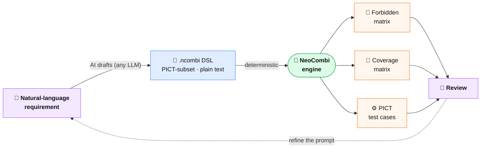

# NeoCombi

[](https://github.com/sho1884/NeoCombi/releases)
[](https://github.com/sho1884/NeoCombi/actions/workflows/ci.yml)
[](LICENSE)

**NeoCombi** is a combinatorial test design tool that pairs PICT-compatible DSL authoring with rich visualization. It mirrors Microsoft **PICT**'s constraint language (`IF/THEN/ELSE`, `=`, `<>`, `>`, `>=`, `<`, `<=`, `AND`, `OR`, `NOT`, `IN`) as a first-class subset DSL, parses it locally for instant feedback, and delegates pairwise / N-wise generation to PICT itself when invoked.

**NeoCombi** は、PICT 互換の DSL オーサリングと豊富な可視化を統合した組み合わせテスト設計ツールです。Microsoft **PICT** の制約言語（`IF/THEN/ELSE`・`=`・`<>`・`>`・`>=`・`<`・`<=`・`AND`・`OR`・`NOT`・`IN`）を一級のサブセット DSL として mirror し、ローカルで即時パースして即フィードバックを返し、ペアワイズ／N-wise 生成は PICT 本体に委譲します。

NeoCombi is a modern reconstruction of the author's older Excel VBA tool **PICT-PAPP**, scaled to handle HAYST-method workloads of 100–300 factors. Files are plain PICT input plus a few `# @neocombi:` annotations, so a model file is also a valid PICT model. There are two native extensions: **`.ncombi`** holds the DSL model alone (shareable, CI-facing), and **`.ncproj`** is a full project that also embeds the generated test set with its IDs, count flags, and notes (legacy `.tmodel` files still open).

NeoCombi は著者の旧 Excel VBA ツール **PICT-PAPP** を、HAYST 法 100〜300 因子規模の実務に耐えるよう再構築したものです。ファイルはプレーンな PICT 入力に少数の `# @neocombi:` 注釈を足しただけなので、モデルファイルはそのまま有効な PICT モデルにもなります。ネイティブ拡張子は2種類：**`.ncombi`** は DSL モデル単体（共有・CI 向け）、**`.ncproj`** は生成済みテストセット（ID・カウントフラグ・ノート付き）まで埋め込むフルプロジェクトです（旧 `.tmodel` も開けます）。

> **Try the demo / デモを試す:** https://neo-combi.vercel.app/ — author DSL, visualize forbidden combinations, and generate test cases live. Decision-table generation runs in your browser; pairwise runs against a hosted PICT service. / DSL を書き、禁則の組み合わせを可視化し、テストケースをその場で生成できます。デシジョンテーブル生成はブラウザ内で動作し、ペアワイズはホスト型 PICT サービスを呼びます。
>
> **Open a sample / 例題を開く** (loaded via the `?file=<url>` parameter; sample models live outside the app). Each content example is available in English and Japanese / 各例題は英語版・日本語版あり:
> - **Shopping site / ショッピング** — the valid-flow model for a runnable mock checkout site, the [KASANE STORE Checkout Benchmark](https://modellogue.com/checkout-benchmark/): a mask level (`_MASK_`) for fields that don't exist at all, plus the constraints its rules imply. 実在する模擬決済サイトの有効系モデル（欄そのものが無い項目を `_MASK_` で表現） — [EN](https://neo-combi.vercel.app/?file=https://sho1884.github.io/public-files/NeoCombi/Samples/shopping-en.ncombi) · [JA](https://neo-combi.vercel.app/?file=https://sho1884.github.io/public-files/NeoCombi/Samples/shopping.ncombi)
> - **Multifunction printer / 複合機（とじしろ）** — binding-margin geometry: valid gutters depend on orientation × duplex — [EN](https://neo-combi.vercel.app/?file=https://sho1884.github.io/public-files/NeoCombi/Samples/mfp-en.ncombi) · [JA](https://neo-combi.vercel.app/?file=https://sho1884.github.io/public-files/NeoCombi/Samples/mfp.ncombi)
> - **Copier N-up & zoom / 複合機（N-up・倍率）** — when a hidden control needs a `_MASK_` level, and when a locked field is just a fixed value — [EN](https://neo-combi.vercel.app/?file=https://sho1884.github.io/public-files/NeoCombi/Samples/mfp-zoom-en.ncombi) · [JA](https://neo-combi.vercel.app/?file=https://sho1884.github.io/public-files/NeoCombi/Samples/mfp-zoom.ncombi)
> - **Admission fee / 入館料** — a decision table: inputs determine the fee, enforced by constraints (the fee is an expected-result factor) — [EN](https://neo-combi.vercel.app/?file=https://sho1884.github.io/public-files/NeoCombi/Samples/admission-fee-en.ncombi) · [JA](https://neo-combi.vercel.app/?file=https://sho1884.github.io/public-files/NeoCombi/Samples/admission-fee.ncombi)
> - **Browsers / ブラウザ** — small pairwise model — [EN](https://neo-combi.vercel.app/?file=https://sho1884.github.io/public-files/NeoCombi/Samples/browsers.ncombi) · [JA](https://neo-combi.vercel.app/?file=https://sho1884.github.io/public-files/NeoCombi/Samples/browsers-ja.ncombi)
> - **Scale fixtures / スケール検証** (synthetic, language-neutral) — [50 factors](https://neo-combi.vercel.app/?file=https://sho1884.github.io/public-files/NeoCombi/Samples/large-50.ncombi) · [100 factors](https://neo-combi.vercel.app/?file=https://sho1884.github.io/public-files/NeoCombi/Samples/large-100.ncombi)

> **Docs / ドキュメント:** [`Doc/User_Manual.md`](Doc/User_Manual.md) — for people *using* the tool (GUI, DSL, generation, export) / ツールを *使う* 人向け（GUI・DSL・生成・エクスポート）. · [`Doc/Deployment_Guide.md`](Doc/Deployment_Guide.md) — for administrators *self-hosting* it (PICT service, CLI in CI/CD, HTTP API, security) / *セルフホスト* する管理者向け（PICT サービス・CI/CD の CLI・HTTP API・セキュリティ）. Both bilingual / いずれも日英併記.

> **Status / 状態: v0.1 (MVP)** — DSL authoring, factor / level editing, forbidden visualization, in-GUI test case generation via a local PICT service, expected-value tracking, and a CLI for CI/CD pipelines. Tested on models up to 100 factors / ~4 levels each. / DSL オーサリング、因子・水準編集、禁則可視化、ローカル PICT サービス経由の GUI 内テストケース生成、期待値トラッキング、CI/CD 向け CLI。100 因子・各約4水準までのモデルで検証済み。


## Built for AI-assisted authoring / AI オーサリングを前提とした設計

AI-assisted authoring is a **first-class premise** of NeoCombi, not a bolt-on. NeoCombi itself embeds **no AI** — it stays a deterministic transformer — but every choice in the model format is made so that an LLM can *author* the design and NeoCombi can *verify* it. The AI writes the model; NeoCombi keeps it honest.

AI によるオーサリングは NeoCombi の **前提** であり、後付けではありません。NeoCombi 自体は **AI を内蔵しません**（決定論変換器のままです）が、モデル形式のあらゆる選択は「LLM が設計を *書き*、NeoCombi がそれを *検証する*」ために行われています。AI がモデルを書き、NeoCombi が正しさを担保します。



Why the format makes AI *design* the test model easily / なぜこの形式は AI に *設計させやすい* のか:

- **Plain-text, PICT-subset DSL.** No proprietary binary, no bespoke schema an LLM has to be taught — it is the widely documented Microsoft PICT constraint language, so any capable model can already write it well. / プレーンテキストの PICT サブセット DSL。独自バイナリも、LLM に教え込む独自スキーマも不要。広く文書化された Microsoft PICT の制約言語そのものなので、能力の高いモデルはすでに上手く書けます。
- **A `.ncombi` file is also a valid PICT model.** The AI's output is directly runnable; there is no lossy translation layer for a model to hallucinate around. / `.ncombi` はそのまま有効な PICT モデル。AI の出力は直接実行でき、幻覚の温床になる変換レイヤーがありません。
- **Deterministic verification closes the loop.** The forbidden matrix, coverage matrix, and PICT generation give the AI (or a human reviewer) an objective signal to refine against — the same input always yields the same output. / 決定論的な検証がループを閉じる。禁則マトリクス・カバレッジ表・PICT 生成が、AI（や人間のレビュアー）に refine の客観指標を与えます。同じ入力からは常に同じ出力。
- **Review-driven by design.** Today you can draft a model with any LLM and paste the DSL straight in; the roadmap (UR-007) brings natural-language → DSL authoring in-app, and **ModelLogue** layers AI review on top via n8n. / レビュー駆動の設計。現状でも任意の LLM でモデルを書いて DSL を貼り付けられます。ロードマップ（UR-007）でアプリ内の 自然言語 → DSL オーサリングを、**ModelLogue** が n8n 経由で AI レビューを重ねます。

## Sibling Projects / 姉妹プロジェクト

NeoCombi is one of three sibling tools that share the factor / level / constraint problem domain. The two authoring tools are deterministic; AI lives *outside* them, reached through n8n.

NeoCombi は、因子・水準・制約という問題領域を共有する3兄弟ツールの一つです。オーサリングツール2つは決定論的で、AI はその *外* に置かれ、n8n を介して呼び出されます。


- **[NeoCEG](https://github.com/sho1884/NeoCEG)** — Cause-Effect Graph authoring tool. / 原因結果グラフ（CEG）のオーサリングツール。
- **[ModelLogue](https://github.com/sho1884/ModelLogue)** — AI-assisted review platform that consumes NeoCEG / NeoCombi outputs as model-type plug-ins. / NeoCEG / NeoCombi の出力を model-type プラグインとして受け取る AI レビュープラットフォーム。

NeoCEG and NeoCombi are **deterministic transformers** (no AI inside). ModelLogue provides AI review on top via n8n. / NeoCEG と NeoCombi は **決定論変換器**（AI 非内蔵）。ModelLogue が n8n 経由で AI レビューを上乗せします。

See [`Doc/PROJECT_KICKOFF.md`](Doc/PROJECT_KICKOFF.md) for the full architectural rationale. / 詳細なアーキテクチャの根拠は [`Doc/PROJECT_KICKOFF.md`](Doc/PROJECT_KICKOFF.md) を参照。

## What's in v0.1 / v0.1 の対応範囲

| User Requirement / 要求 | Coverage / 対応 |
|---|---|
| UR-001 Generate pairwise test cases / ペアワイズ生成 | ✅ in the GUI via the local PICT service, and on the CLI / GUI（ローカル PICT サービス経由）と CLI |
| UR-002 Author factors, levels, constraints / 因子・水準・制約の編集 | ✅ DSL editor + Factors & Levels inline editing (rename / drag-reorder) / DSL エディタ＋因子・水準タブでのインライン編集（改名・ドラッグ並べ替え） |
| UR-003 Verify forbidden combinations / 禁則の確認 | ✅ live forbidden matrix with constraint-propagation slice suggestions / 制約伝播スライス提案つきのライブ禁則マトリクス |
| UR-004 Verify pair coverage / ペア網羅の確認 | ✅ cross-tabulation matrix with covered / missed / forbidden cells + summary / 網羅・未網羅・禁則セル＋サマリのクロス集計表 |
| UR-005 Record a note per test case / テストケースへのノート | ✅ editable **Notes** column, persisted in `.ncproj` / 編集可能な **Notes** 列、`.ncproj` に保存 |
| UR-010 Gate coverage by a count flag / カウントフラグで網羅を制御 | ✅ per-case stable ID (`P01`/`D0001`) + **Count** flag; coverage counts only flagged-in cases; three-column `id,count,note` results write-back / 安定 ID＋**Count** フラグ。網羅はフラグ対象のみ集計。`id,count,note` の3列書き戻し |
| UR-011 Persist the test set; resume without regenerating / テストセットを永続化し無再生成で再開 | ✅ the generated set (rows, IDs, flags, notes) is saved in `.ncproj` and restored verbatim; regeneration is explicit and guarded / 生成結果を `.ncproj` に保存しそのまま復元。再生成は明示かつガード付き |
| UR-006 Invoke from CI/CD pipeline / CI/CD からの呼び出し | ✅ `neocombi generate` CLI with deterministic exit codes / 決定論的な終了コードを持つ `neocombi generate` CLI |
| UR-007 Natural-language → AI → DSL / 自然言語 → AI → DSL | ⛔ planned for v2 / v2 で予定 |

PICT-PAPP features deliberately deferred to v2: Alloy verification of indirect forbidden, level-value substitution test data generation, and the auto-generated DSL from a hand-edited forbidden matrix. See [`Doc/requirements/Requirements_Specification.md`](Doc/requirements/Requirements_Specification.md) for the full MVP scope. / v2 に意図的に見送った PICT-PAPP 由来機能：間接禁則の Alloy 検証、水準値置換によるテストデータ生成、手編集した禁則マトリクスからの DSL 自動生成。MVP の全スコープは [`Doc/requirements/Requirements_Specification.md`](Doc/requirements/Requirements_Specification.md) を参照。

## Quick start / クイックスタート

### Install / インストール

NeoCombi requires Node.js 20+ and (for actual test case generation) Microsoft PICT on `PATH`. / NeoCombi は Node.js 20+ と、実際のテストケース生成には `PATH` 上の Microsoft PICT を必要とします。

```bash
# install PICT / PICT の導入
sudo apt install pict       # Linux (Debian / Ubuntu)
brew install pict           # macOS
# Windows: download a build from https://github.com/microsoft/pict

# clone and install JS dependencies / クローンして JS 依存を導入
git clone https://github.com/sho1884/NeoCombi.git
cd NeoCombi
npm install
```

### Author in the GUI / GUI でオーサリング

Two terminals — one for the dev server, one for the local PICT service that the GUI calls to generate test cases. / 端末を2つ — 一方は開発サーバ、もう一方は GUI がテストケース生成で呼ぶローカル PICT サービス。

```bash
npm run dev                                    # vite dev server (http://localhost:5173)
docker compose up --build pict-service         # in another shell — local PICT API (http://localhost:5174)
```

Open `http://localhost:5173`. The header has **New / Open / Save / Save As** buttons backed by the File System Access API on Chrome / Edge (download fallback on Firefox / Safari). / `http://localhost:5173` を開きます。ヘッダの **New / Open / Save / Save As** は Chrome / Edge では File System Access API を使い、Firefox / Safari ではダウンロードにフォールバックします。

A typical session / 典型的なセッション:

1. **DSL** tab — write parameters and constraints (subset of PICT BNF; see [`Doc/DSL_Grammar_Specification.md`](Doc/DSL_Grammar_Specification.md)). / パラメータと制約を記述（PICT BNF のサブセット）。
2. **Factors & Levels** tab — same data shown as a table; rename factors, add or remove levels inline, drag rows or level chips to reorder. Renames automatically rewrite `[refs]` in constraints. / 同じデータを表で表示。因子の改名、水準のインライン追加・削除、行や水準チップのドラッグ並べ替え。改名は制約内の `[参照]` を自動で書き換えます。
3. **Top pane → Coverage** — exhaustive cross-tabulation with covered / missed / forbidden cells. The **Show** column in the Factors & Levels tab controls which factors appear here. / 全網羅のクロス集計（網羅・未網羅・禁則セル）。表示する因子は Factors & Levels タブの **Show** 列で制御。
4. **Top pane → Forbidden** — live forbidden-combination matrix computed from the DSL by the in-house evaluator (no PICT spawn needed). The ✨ **Suggest from constraints** button proposes slices automatically, including propagation slices across multiple constraints. / DSL から内製 evaluator が計算するライブ禁則マトリクス（PICT 起動不要）。✨ **Suggest from constraints** が複数制約にまたがる伝播スライスを含めて自動提案。
5. **Test cases** tab — the first set is generated automatically once the DSL parses; after that, click **Re-generate** for an explicit (guarded) run. Each case has a stable **ID** (`P01`/`D0001`), a **Count** flag (only flagged-in cases count toward coverage), and a free-form **Notes** column. **Import results…** writes back a three-column `id,count,note` CSV. / DSL がパースできると最初のセットが自動生成され、以後は **Re-generate** で明示（ガード付き）実行。各ケースは安定 **ID**、**Count** フラグ（対象のみ網羅に算入）、自由記述の **Notes** 列を持ちます。**Import results…** は `id,count,note` の3列 CSV を書き戻します。
6. **Save As…** writes a **`.ncproj`** project (DSL + the test set with its IDs, flags, and notes) you can re-open and resume without regenerating — or pick **`.ncombi`** to export just the DSL model for CI / sharing. / **`.ncproj`**（DSL＋ID・フラグ・ノート付きのテストセット）を保存すれば無再生成で再開でき、**`.ncombi`** を選べば DSL モデルのみを CI・共有向けに書き出せます。

### Install as a PWA / PWA としてインストール

The dev server (and any production deployment) ships a Web App Manifest. Chrome / Edge will offer an "Install NeoCombi" affordance in the address-bar menu; once installed, NeoCombi runs as a standalone window with the K₅ icon. / 開発サーバ（および本番デプロイ）は Web App Manifest を同梱します。Chrome / Edge はアドレスバーのメニューに「Install NeoCombi」を提示し、インストール後は K₅ アイコンの独立ウィンドウとして動作します。

### Generate test cases on the CLI / CLI でテストケースを生成

```bash
node bin/neocombi.mjs generate path/to/model.ncombi
```

The CLI reads a `.ncombi` model (a `.ncproj` or legacy `.tmodel` also works — it reads the DSL and always regenerates), validates the DSL, runs PICT, and prints CSV to stdout. Common flags: / CLI は `.ncombi` モデル（`.ncproj` や旧 `.tmodel` も可 — DSL を読んで常に再生成）を読み、DSL を検証し、PICT を実行して CSV を stdout に出力します。主なフラグ:

```bash
neocombi generate model.ncombi --format json --output cases.json
neocombi generate model.ncombi --order 3                # 3-wise instead of pairwise
neocombi generate model.ncombi --pict /opt/bin/pict     # explicit PICT path
NEOCOMBI_PICT_PATH=/opt/bin/pict neocombi generate model.ncombi
```

Exit codes for CI / CI 向け終了コード:

| Code / コード | Meaning / 意味 |
|---|---|
| 0 | success / 成功 |
| 1 | DSL parse / validation error / DSL パース・検証エラー |
| 2 | PICT invocation failed / PICT 実行失敗 |
| 3 | input file not found / unreadable / 入力ファイルなし・読取不可 |
| 4 | output write failed / 出力書き込み失敗 |

### Import CLI output back into the GUI / CLI 出力を GUI に取り込む

In the **Test cases** tab, click **Import CSV…** and pick the file the CLI produced. The grid populates and the upper-pane coverage matrix overlays occurrence counts. / **Test cases** タブで **Import CSV…** をクリックし、CLI が出力したファイルを選ぶと、グリッドが埋まり、上ペインのカバレッジ表に出現回数が重畳表示されます。

## File format / ファイル形式 (`.ncombi` / `.ncproj`)

Both extensions share one on-disk grammar: plain PICT DSL plus NeoCombi-specific annotations carried in PICT-compatible comments. A **`.ncombi`** model carries the DSL, generation settings, and expected-value rules; a **`.ncproj`** project adds the persisted test set (one `# @neocombi:case` line per row). Legacy `.tmodel` files still open.

両拡張子は同一のディスク上文法を共有します。プレーンな PICT DSL に、PICT 互換コメントで運ぶ NeoCombi 固有の注釈を足したものです。**`.ncombi`** は DSL・生成設定・期待値ルールを、**`.ncproj`** はさらに永続化したテストセット（1行につき `# @neocombi:case` 1行）を持ちます。旧 `.tmodel` も開けます。

```
OS:      Linux, Windows, macOS
Browser: Chrome, Firefox, Safari

IF [OS] = "Linux" THEN [Browser] <> "Safari";

# ===== NeoCombi annotations (auto-generated; do not edit) =====
# @neocombi:order 3
# @neocombi:expected OS=Linux Browser=Chrome | Renders OK
# --- the lines below appear only in a .ncproj project ---
# @neocombi:caseset-factors OS Browser
# @neocombi:case id=P1 count=1 OS=Linux Browser=Chrome | Renders OK
```

Because annotation lines are PICT comments, you can also feed a `.ncombi` file directly to PICT. / 注釈行は PICT コメントなので、`.ncombi` をそのまま PICT に渡すこともできます。

```bash
pict model.ncombi /o:2
```

## Tech stack / 技術スタック

React 19 · TypeScript 5.9 (strict) · Vite 7 · Zustand 5 · Vitest 3 · ESLint 9 · vite-plugin-pwa 1.

The stack mirrors NeoCEG to keep operational consistency across sibling tools. Tailwind CSS is mentioned in CLAUDE.md but is not yet introduced — current styling is plain CSS scoped per component. / スタックは兄弟ツール間の運用一貫性のため NeoCEG に揃えています。Tailwind CSS は CLAUDE.md に記載がありますが未導入で、現状はコンポーネント単位にスコープしたプレーン CSS です。

## External dependency / 外部依存

NeoCombi delegates pairwise / N-wise generation to **PICT** (Microsoft, MIT License). PICT is **not bundled** — users install it themselves; NeoCombi spawns it as a child process from the CLI. / NeoCombi はペアワイズ／N-wise 生成を **PICT**（Microsoft, MIT License）に委譲します。PICT は **同梱しません** — 利用者が自分で導入し、NeoCombi は CLI から子プロセスとして起動します。

- Linux: `apt install pict`, or build from source / ソースからビルド
- macOS: `brew install pict`
- Windows: download from https://github.com/microsoft/pict

The DSL evaluator that powers the live forbidden matrix is implemented locally in NeoCombi and does **not** require PICT to be installed. / ライブ禁則マトリクスを動かす DSL evaluator は NeoCombi 内に実装されており、PICT のインストールを **必要としません**。

## Documentation / ドキュメント

- [`CLAUDE.md`](CLAUDE.md) — project guidelines (security, license policy, AI-assisted development) / プロジェクト方針（セキュリティ・ライセンス方針・AI 支援開発）
- [`Doc/PROJECT_KICKOFF.md`](Doc/PROJECT_KICKOFF.md) — architectural rationale and 3-sibling context / アーキテクチャの根拠と3兄弟の文脈
- [`Doc/requirements/Requirements_Specification.md`](Doc/requirements/Requirements_Specification.md) — UR / SR specification / UR・SR 仕様
- [`Doc/DSL_Grammar_Specification.md`](Doc/DSL_Grammar_Specification.md) — PICT-subset EBNF / PICT サブセット EBNF
- [`Doc/ADR_Index.md`](Doc/ADR_Index.md) — recorded architecture decisions / 記録済みアーキテクチャ決定
- [`examples/`](examples/) — sample `.ncombi` model files / サンプル `.ncombi` モデル

## License / ライセンス

MIT — see [LICENSE](LICENSE). / MIT。[LICENSE](LICENSE) を参照。
