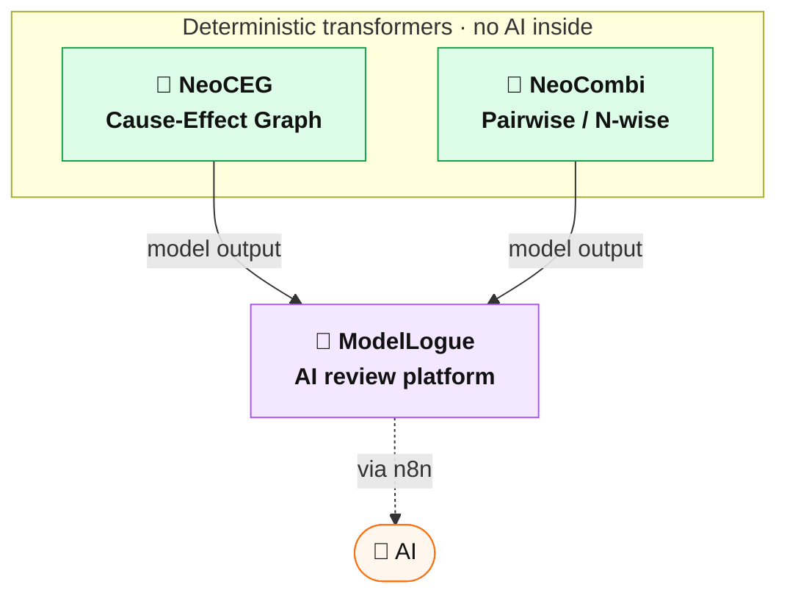

# NeoCombi

[](https://github.com/sho1884/NeoCombi/releases)
[](https://github.com/sho1884/NeoCombi/actions/workflows/ci.yml)
[](LICENSE)

> **Try the demo:** https://neo-combi.vercel.app/ — author DSL, visualize forbidden combinations, and generate test cases live. Decision-table generation runs in your browser; pairwise runs against a hosted PICT service.
>
> **Open a sample** (loaded via the `?file=<url>` parameter; sample models live outside the app). Each content example is available in English and Japanese / 各例題は英語版・日本語版あり:
> - **Shopping site / ショッピング** — a mask level (`_MASK_`) + several constraints — [EN](https://neo-combi.vercel.app/?file=https://sho1884.github.io/public-files/NeoCombi/Samples/shopping-en.ncombi) · [JA](https://neo-combi.vercel.app/?file=https://sho1884.github.io/public-files/NeoCombi/Samples/shopping.ncombi)
> - **Multifunction printer / 複合機（とじしろ）** — binding-margin geometry: valid gutters depend on orientation × duplex — [EN](https://neo-combi.vercel.app/?file=https://sho1884.github.io/public-files/NeoCombi/Samples/mfp-en.ncombi) · [JA](https://neo-combi.vercel.app/?file=https://sho1884.github.io/public-files/NeoCombi/Samples/mfp.ncombi)
> - **Copier N-up & zoom / 複合機（N-up・倍率）** — when a hidden control needs a `_MASK_` level, and when a locked field is just a fixed value — [EN](https://neo-combi.vercel.app/?file=https://sho1884.github.io/public-files/NeoCombi/Samples/mfp-zoom-en.ncombi) · [JA](https://neo-combi.vercel.app/?file=https://sho1884.github.io/public-files/NeoCombi/Samples/mfp-zoom.ncombi)
> - **Admission fee / 入館料** — a decision table: inputs determine the fee, enforced by constraints (the fee is an expected-result factor) — [EN](https://neo-combi.vercel.app/?file=https://sho1884.github.io/public-files/NeoCombi/Samples/admission-fee-en.ncombi) · [JA](https://neo-combi.vercel.app/?file=https://sho1884.github.io/public-files/NeoCombi/Samples/admission-fee.ncombi)
> - **Browsers / ブラウザ** — small pairwise model — [EN](https://neo-combi.vercel.app/?file=https://sho1884.github.io/public-files/NeoCombi/Samples/browsers.ncombi) · [JA](https://neo-combi.vercel.app/?file=https://sho1884.github.io/public-files/NeoCombi/Samples/browsers-ja.ncombi)
> - **Scale fixtures** (synthetic, language-neutral) — [50 factors](https://neo-combi.vercel.app/?file=https://sho1884.github.io/public-files/NeoCombi/Samples/large-50.ncombi) · [100 factors](https://neo-combi.vercel.app/?file=https://sho1884.github.io/public-files/NeoCombi/Samples/large-100.ncombi)

> **Docs:** [`Doc/User_Manual.md`](Doc/User_Manual.md) — for people *using* the tool (GUI, DSL, generation, export). · [`Doc/Deployment_Guide.md`](Doc/Deployment_Guide.md) — for administrators *self-hosting* it (PICT service, CLI in CI/CD, HTTP API, security). Both bilingual.

> **Status: v0.1 (MVP)** — DSL authoring, factor / level editing, forbidden visualization, in-GUI test case generation via a local PICT service, expected-value tracking, and a CLI for CI/CD pipelines. Tested on models up to 100 factors / ~4 levels each.

**NeoCombi** is a combinatorial test design tool that pairs PICT-compatible DSL authoring with rich visualization. It mirrors Microsoft **PICT**'s constraint language (`IF/THEN/ELSE`, `=`, `<>`, `>`, `>=`, `<`, `<=`, `AND`, `OR`, `NOT`, `IN`) as a first-class subset DSL, parses it locally for instant feedback, and delegates pairwise / N-wise generation to PICT itself when invoked.

NeoCombi is a modern reconstruction of the author's older Excel VBA tool **PICT-PAPP**, scaled to handle HAYST-method workloads of 100–300 factors. Files are plain PICT input plus a few `# @neocombi:` annotations, so a model file is also a valid PICT model. There are two native extensions: **`.ncombi`** holds the DSL model alone (shareable, CI-facing), and **`.ncproj`** is a full project that also embeds the generated test set with its IDs, count flags, and notes (legacy `.tmodel` files still open).

## Built for AI-assisted authoring

AI-assisted authoring is a **first-class premise** of NeoCombi, not a bolt-on. NeoCombi itself embeds **no AI** — it stays a deterministic transformer — but every choice in the model format is made so that an LLM can *author* the design and NeoCombi can *verify* it. The AI writes the model; NeoCombi keeps it honest.


Why the format makes AI *design* the test model easily:

- **Plain-text, PICT-subset DSL.** No proprietary binary, no bespoke schema an LLM has to be taught — it is the widely documented Microsoft PICT constraint language, so any capable model can already write it well.
- **A `.ncombi` file is also a valid PICT model.** The AI's output is directly runnable; there is no lossy translation layer for a model to hallucinate around.
- **Deterministic verification closes the loop.** The forbidden matrix, coverage matrix, and PICT generation give the AI (or a human reviewer) an objective signal to refine against — the same input always yields the same output.
- **Review-driven by design.** Today you can draft a model with any LLM and paste the DSL straight in; the roadmap (UR-007) brings natural-language → DSL authoring in-app, and **ModelLogue** layers AI review on top via n8n.

## Sibling Projects

NeoCombi is one of three sibling tools that share the factor / level / constraint problem domain. The two authoring tools are deterministic; AI lives *outside* them, reached through n8n:



- **[NeoCEG](https://github.com/sho1884/NeoCEG)** — Cause-Effect Graph authoring tool.
- **[ModelLogue](https://github.com/sho1884/ModelLogue)** — AI-assisted review platform that consumes NeoCEG / NeoCombi outputs as model-type plug-ins.

NeoCEG and NeoCombi are **deterministic transformers** (no AI inside). ModelLogue provides AI review on top via n8n.

See [`Doc/PROJECT_KICKOFF.md`](Doc/PROJECT_KICKOFF.md) for the full architectural rationale.

## What's in v0.1

| User Requirement | Coverage |
|---|---|
| UR-001 Generate pairwise test cases | ✅ in the GUI via the local PICT service, and on the CLI |
| UR-002 Author factors, levels, constraints | ✅ DSL editor + Factors & Levels inline editing (rename / drag-reorder) |
| UR-003 Verify forbidden combinations | ✅ live forbidden matrix with constraint-propagation slice suggestions |
| UR-004 Verify pair coverage | ✅ cross-tabulation matrix with covered / missed / forbidden cells + summary |
| UR-005 Record a note per test case | ✅ editable **Notes** column on each test case, persisted in `.ncproj` |
| UR-010 Gate coverage by a count flag | ✅ per-case stable ID (`P01`/`D0001`) + **Count** flag; coverage counts only flagged-in cases; three-column `id,count,note` results write-back |
| UR-011 Persist the test set; resume without regenerating | ✅ the generated set (rows, IDs, flags, notes) is saved in `.ncproj` and restored verbatim; regeneration is explicit and guarded |
| UR-006 Invoke from CI/CD pipeline | ✅ `neocombi generate` CLI with deterministic exit codes |
| UR-007 Natural-language → AI → DSL | ⛔ planned for v2 |

PICT-PAPP features deliberately deferred to v2: Alloy verification of indirect forbidden, level-value substitution test data generation, and the auto-generated DSL from a hand-edited forbidden matrix. See [`Doc/requirements/Requirements_Specification.md`](Doc/requirements/Requirements_Specification.md) for the full MVP scope.

## Quick start

### Install

NeoCombi requires Node.js 20+ and (for actual test case generation) Microsoft PICT on `PATH`.

```bash
# install PICT
sudo apt install pict       # Linux (Debian / Ubuntu)
brew install pict           # macOS
# Windows: download a build from https://github.com/microsoft/pict

# clone and install JS dependencies
git clone https://github.com/sho1884/NeoCombi.git
cd NeoCombi
npm install
```

### Author in the GUI

Two terminals — one for the dev server, one for the local PICT service that the GUI calls to generate test cases:

```bash
npm run dev                                    # vite dev server (http://localhost:5173)
docker compose up --build pict-service         # in another shell — local PICT API (http://localhost:5174)
```

Open `http://localhost:5173`. The header has **New / Open / Save / Save As** buttons backed by the File System Access API on Chrome / Edge (download fallback on Firefox / Safari).

A typical session:

1. **DSL** tab — write parameters and constraints (subset of PICT BNF; see [`Doc/DSL_Grammar_Specification.md`](Doc/DSL_Grammar_Specification.md)).
2. **Factors & Levels** tab — same data shown as a table; rename factors, add or remove levels inline, drag rows or level chips to reorder. Renames automatically rewrite `[refs]` in constraints.
3. **Top pane → Coverage** — exhaustive cross-tabulation with covered / missed / forbidden cells. The **Show** column in the Factors & Levels tab controls which factors appear here (per-row checkboxes plus All / None bulk toggles in the column header).
4. **Top pane → Forbidden** — live forbidden-combination matrix computed from the DSL by the in-house evaluator (no PICT spawn needed). The ✨ **Suggest from constraints** button proposes slices automatically, including propagation slices that surface chained restrictions across multiple constraints.
5. **Test cases** tab — the first set is generated automatically once the DSL parses; after that, click **Re-generate** for an explicit (guarded) run. Each case has a stable **ID** (`P01`/`D0001`), a **Count** flag (only flagged-in cases count toward coverage), and a free-form **Notes** column. **Import results…** writes back a three-column `id,count,note` CSV from an external execution system.
6. **Save As…** writes a **`.ncproj`** project (DSL + the test set with its IDs, flags, and notes) you can re-open and resume without regenerating — or pick **`.ncombi`** to export just the DSL model for CI / sharing.

### Install as a PWA

The dev server (and any production deployment) ships a Web App Manifest. Chrome / Edge will offer an "Install NeoCombi" affordance in the address-bar menu; once installed, NeoCombi runs as a standalone window with the K₅ icon.

### Generate test cases on the CLI

```bash
node bin/neocombi.mjs generate path/to/model.ncombi
```

The CLI reads a `.ncombi` model (a `.ncproj` or legacy `.tmodel` also works — it reads the DSL and always regenerates), validates the DSL, runs PICT, and prints CSV to stdout. Common flags:

```bash
neocombi generate model.ncombi --format json --output cases.json
neocombi generate model.ncombi --order 3                # 3-wise instead of pairwise
neocombi generate model.ncombi --pict /opt/bin/pict     # explicit PICT path
NEOCOMBI_PICT_PATH=/opt/bin/pict neocombi generate model.ncombi
```

Exit codes for CI:

| Code | Meaning |
|---|---|
| 0 | success |
| 1 | DSL parse / validation error |
| 2 | PICT invocation failed |
| 3 | input file not found / unreadable |
| 4 | output write failed |

### Import CLI output back into the GUI

In the **Test cases** tab, click **Import CSV…** and pick the file the CLI produced. The grid populates and the upper-pane coverage matrix overlays occurrence counts.

## File format (`.ncombi` / `.ncproj`)

Both extensions share one on-disk grammar: plain PICT DSL plus NeoCombi-specific
annotations carried in PICT-compatible comments. A **`.ncombi`** model carries the
DSL, generation settings, and expected-value rules; a **`.ncproj`** project adds the
persisted test set (one `# @neocombi:case` line per row). Legacy `.tmodel` files
still open.

```
OS:      Linux, Windows, macOS
Browser: Chrome, Firefox, Safari

IF [OS] = "Linux" THEN [Browser] <> "Safari";

# ===== NeoCombi annotations (auto-generated; do not edit) =====
# @neocombi:order 3
# @neocombi:expected OS=Linux Browser=Chrome | Renders OK
# --- the lines below appear only in a .ncproj project ---
# @neocombi:caseset-factors OS Browser
# @neocombi:case id=P1 count=1 OS=Linux Browser=Chrome | Renders OK
```

Because annotation lines are PICT comments, you can also feed a `.ncombi` file directly to PICT:

```bash
pict model.ncombi /o:2
```

## Tech stack

React 19 · TypeScript 5.9 (strict) · Vite 7 · Zustand 5 · Vitest 3 · ESLint 9 · vite-plugin-pwa 1.

The stack mirrors NeoCEG to keep operational consistency across sibling tools. Tailwind CSS is mentioned in CLAUDE.md but is not yet introduced — current styling is plain CSS scoped per component.

## External dependency

NeoCombi delegates pairwise / N-wise generation to **PICT** (Microsoft, MIT License). PICT is **not bundled** — users install it themselves; NeoCombi spawns it as a child process from the CLI:

- Linux: `apt install pict`, or build from source
- macOS: `brew install pict`
- Windows: download from https://github.com/microsoft/pict

The DSL evaluator that powers the live forbidden matrix is implemented locally in NeoCombi and does **not** require PICT to be installed.

## Documentation

- [`CLAUDE.md`](CLAUDE.md) — project guidelines (security, license policy, AI-assisted development)
- [`Doc/PROJECT_KICKOFF.md`](Doc/PROJECT_KICKOFF.md) — architectural rationale and 3-sibling context
- [`Doc/requirements/Requirements_Specification.md`](Doc/requirements/Requirements_Specification.md) — UR / SR specification
- [`Doc/DSL_Grammar_Specification.md`](Doc/DSL_Grammar_Specification.md) — PICT-subset EBNF
- [`Doc/ADR_Index.md`](Doc/ADR_Index.md) — recorded architecture decisions
- [`examples/`](examples/) — sample `.ncombi` model files

## License

MIT — see [LICENSE](LICENSE).
